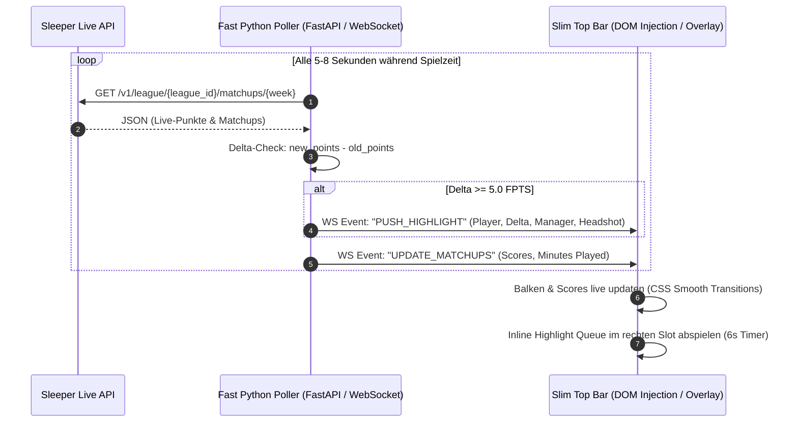

# 🎮 NFL Fantasy Live Game HUD — Ultra-Slim Top Bar Konzept

Ein minimalistisches, broadcast-taugliches Stream-Overlay (**OBS Browser Source / Web Overlay / Floating Window**), das als **einziges schlankes horizontales Band (68px) am oberen Bildschirmrand** über dem Livestream liegt. Das eigentliche Videobild darunter bleibt zu **100% frei und unverdeckt**.

---

## 🖥️ 1. Screen Layout & Visual Hierarchy

Das gesamte Overlay beschränkt sich auf einen **64px – 72px hohen Streifen am oberen Rand** des 16:9 Streams (1920x1080).

```
+-------------------------------------------------------------------------------------------------------+
| [ ULTRA-SLIM TOP BAR (Höhe: 68px) | background: rgba(10,15,29,0.92) blur(10px) ]                      |
|                                                                                                       |
|  +---------------------+  +---------------------+  +---------------------+  +----------------------+  |
|  | MATCHUP 1 (24%)     |  | MATCHUP 2 (24%)     |  | MATCHUP 3 (24%)     |  | 🔥 HIGHLIGHT QUEUE   |  |
|  | Team A   94.2 [====]|  | Team C   82.1 [=== ]|  | Team E  104.5 [====]|  | [Avatar] J. Allen    |  |
|  | Team B   88.4 [=== ]|  | Team D   79.0 [==  ]|  | Team F  112.3 [=====|  | +6.4 FPTS TD (wetsch)|  |
|  | ⏱ 75% Time Played   |  | ⏱ 40% Time Played   |  | ⏱ 90% Time Played   |  | (Queue: 1/3 • 6s)    |  |
|  +---------------------+  +---------------------+  +---------------------+  +----------------------+  |
+-------------------------------------------------------------------------------------------------------+
|                                                                                                       |
|                                                                                                       |
|                               ( 100% FREIES LIVESTREAM VIDEOBILD )                                   |
|                                                                                                       |
|                                                                                                       |
+-------------------------------------------------------------------------------------------------------+
```

---

## 💡 2. Wie liegt die Leiste über dem Vollbild-Stream? (3 praktische Methoden)

Je nachdem, wie du den NFL-Stream schaust (im Browser, via OBS oder auf dem Mac/PC), gibt es 3 clevere Wege, die Leiste über den Vollbild-Stream zu legen:

---

### 🌟 Methode 1 (Beste & Einfachste für Browser-Streams): Direct Browser Injection (Tampermonkey / Bookmarklet)
Wenn du den Stream im Browser schaust (z. B. **NFL Game Pass (DAZN), RTL+, YouTube TV, NFL.com**):
* Ein winziges Skript (oder Bookmarklet / Tampermonkey-Erweiterung) injiziert die 68px Top-Bar direkt in den DOM-Baum der Streaming-Webseite oberhalb des `<video>`-Players.
* **Der Vorteil**: Wenn du den Stream auf **Vollbild** klickst, ist die Leiste **automatisch Teil des Vollbild-Videos**!
* Keine extra Software nötig, funktioniert in Safari, Chrome, Brave und Edge.

---

### 🪟 Methode 2: Native macOS App ("Ghost"-Overlay mit Apple Silicon & WebKit)
Wenn du den Stream über eine separate App oder einen beliebigen Video-Player schaust:
* Die native Swift App (`NFL Fantasy HUD.app`) öffnet ein rahmenloses, transparentes Floating Panel am oberen Bildschirmrand:
  - **Always-on-Top Floating Panel** (Level `.screenSaver`): Schwebt dauerhaft über jedem Vollbild-Stream (auch über anderen Spaces & Vollbild-Apps).
  - **100% Click-Through**: Maus- und Klick-Events gehen nahtlos durch zum Video-Player darunter (Play/Pause, Scrubbing, Lautstärke).
  - **Multi-Monitor & Beamer Support**: Live-Auswahl des Ziel-Bildschirms (z. B. Beamer, externer TV, AirPlay-Display oder MacBook-Display) im Setup-Dialog und jederzeit per Menüleiste (`🖥️ Target Display`).
  - **Shortcuts & Audio-Steuerung**: **`Cmd+M`** schaltet Highlight-Sound-Effekte um, **`Cmd+H`** blendet das Overlay ein/aus (und dockt es neu an den Monitor an), **`Cmd+S`** öffnet den Setup-Dialog.
  - **Build-Kommando**: `./build_mac_app.sh` kompiliert die native Apple Silicon App direkt und signiert das Bundle ad-hoc.

#### 📐 Technische Vertiefung: Multi-Monitor & AirPlay / Beamer Geometrie
Beim Betrieb mit externen Displays (wie Beamern oder AirPlay-Empfängern) ordnet macOS Monitore in einem **globalen Koordinatensystem** an:
* Das Hauptdisplay (MacBook Retina) liegt bei `(x: 0, y: 0, w: 1512, h: 982)`.
* Das Beamer-/AirPlay-Display liegt rechts daneben mit globalen Koordinaten, z. B. `(x: 1512, y: -98, w: 1920, h: 1080)`.
* **Behobenes Koordinaten-Phänomen**: Übergibt man bei der Initialisierung von `NSWindow(contentRect:styleMask:backing:defer:screen:)` sowohl globale Koordinaten (`x = 1512`) als auch das Ziel-Screen-Objekt `screen: targetScreen`, interpretiert AppKit das `contentRect` relativ zum Ursprung des Zielmonitors. Die Monitorkoordinate wurde dadurch doppelt addiert (`1512 + 1512 = 3024`), wodurch das Fenster um 1512 Pixel nach rechts ins Aus geschoben wurde und auf dem Beamer nur die ersten ~400 Pixel (`[WK 3]` und das erste Matchup) am rechten Bildschirmrand sichtbar waren.
* **Architektur-Lösung**: Das Overlay-Panel wird mit globalen AppKit-Koordinaten ohne relatives Screen-Offset initialisiert und via `window.setFrame(windowRect)` exakt auf den Zielmonitor gesetzt. Beim Neuverbinden von AirPlay wird der Bildschirm automatisch anhand seines Namens (`localizedName`) wiedererkannt und die innere WebKit-Viewport-Größe (`webView.frame`) synchron aktualisiert.

#### 🚀 Performance- & AirPlay-Optimierung: Stotterfreies Streaming auf Beamer / Apple TV
Bei der drahtlosen Übertragung des Bildschirms via **AirPlay** auf einen Beamer oder ein Apple TV kam es zuvor zu wiederkehrenden Mikrorucklern im Videobild. Die Ursachenanalyse und technische Lösung im Detail:
1. **Reduzierung der Overlay-Fensterfläche um ~93% (78px Top-Band statt 1080px Vollbild)**:
   - *Problem*: Zuvor spannte die native App ein transparentes 1920×1080 Pixel großes Fenster über den gesamten Bildschirm auf. macOS WindowServer musste dadurch bei jedem einzelnen Frame (60 Hz) alle 2.073.600 Pixel per GPU alpha-blenden, was hardwarebeschleunigtes Direct Scanout und Zero-Copy AirPlay Video-Encoding blockierte.
   - *Lösung*: Das native AppKit-Fenster und die innere WebKit-View sind nun exakt auf die 78 Pixel des oberen Balkens (`y = screenRect.maxY - 78`, `h = 78`) beschränkt. Die restlichen **~93% des Beamer-Bildschirms** (1002 von 1080 Pixeln) sind vollkommen fensterfrei. macOS encodiert den darunterlaufenden Videostream direkt per Hardware ohne GPU-Compositor-Overhead.
2. **Eliminierung des zyklischen 2.0s Polling-Timers**:
   - *Problem*: Ein Hintergrundtimer rief alle 2.0 Sekunden `window.orderFrontRegardless()` auf. Jeder dieser Aufrufe unterbrach den macOS WindowServer-Compositor und erzeugte einen rhythmischen Frame-Drop im AirPlay-Stream.
   - *Lösung*: Der Timer wurde vollständig entfernt. Das Fenster bleibt rein event-basiert über das Window-Level `.screenSaver` sowie die Observer `activeSpaceDidChangeNotification` und `didActivateApplicationNotification` im Vordergrund – vollkommen ohne Stream-Unterbrechungen.
3. **In-Bar Toast-Positionierung**:
   - Toasts und Benachrichtigungen werden direkt innerhalb des 78px Top-Bands gerendert, wodurch keine Elemente außerhalb des optimierten Fensters abgeschnitten werden.

---

### 🎥 Methode 3: OBS Studio (für Livestreams / Streaming-Setups)
Wenn du den Stream über OBS Studio capturest oder streamst:
* Lege in OBS eine **Browser Source** an:
  - **URL**: `http://homebridge.local:8080/overlay` (oder `http://192.168.188.147:8080/overlay`)
  - **Breite**: `1920`, **Höhe**: `1080`
* Setze die Browser Source in der Szenenliste über deine Videoquelle. Fertig!

---

## 📊 3. Detaillierte Komponenten-Spezifikation (Alles im Top-Band)

### A. 3 League Matchup Kacheln (Links & Mitte, ca. 75% Gesamtbreite)
Jedes Matchup der 6er-Liga hat seine eigene kompakte Kachel:

1. **Manager & Punktestände**:
   - Manager-Name (z. B. `Team 1`) mit Teamfarbe als linker Akzentstreifen.
   - Live-Punkte in fetter Typografie (z. B. **94.2** vs. **88.4**).
2. **Score Progress Bar (Balken 1 - Punktevergleich)**:
   - Kompakter Dual-Balken, der die Führung zwischen den beiden Managern visualisiert.
3. **Minutes Played / Game Time Progress Bar (Balken 2 - Zeitfortschritt)**:
   - Visualisiert, wie viel Spielzeit die aktiven Starter des Teams bereits absolviert haben vs. wie viele Spieler noch spielen müssen (z. B. `7/9 Spieler fertig` = 78% Time Played).
   - Verhindert Fehlinterpretationen (z. B. wenn Team A führt, aber Team B noch 4 Starter im Spätspiel hat).

---

### B. Inline Highlight Queue Segment (Rechts außen, ca. 25% Gesamtbreite) & Prominente Alerts
Das Highlight-Segment ist **nahtlos in das rechte Ende der oberen Leiste integriert** und ragt **nicht** nach unten ins Videobild hinein.

* **Trigger**: Sobald ein Spieler in einem Play oder Drive **$\ge 5.0$ Fantasy-Punkte** erzielt (z. B. Pass-TD, Big Run, Interception Return).
* **Prominente Visuals & Jiggle-Effekt**:
  - **Entrance Pop & Jiggle** (`@keyframes highlight-entrance-jiggle`): Die Highlight-Box federt mit einem dynamischen Wobble/Jiggle (-2.2° / +2.2°) ein, um sofort ins Auge zu springen, ohne das Spielgeschehen zu verdecken.
  - **Re-Jiggle Burst** (`@keyframes highlight-jiggle-burst`): Kommt ein neues Big Play in die Queue während bereits ein Highlight läuft, reagiert die aktive Kachel mit einem erneuten Ruckeln.
  - **Metallic Light Sheen Sweep**: Ein animierter Glanzstreifen gleitet diagonal über die Highlight-Kachel.
  - **Pulsing Neon Outer Flare**: Verstärkter Neonschein passend zur Teamfarbe des Managers.
  - **Aktions-spezifische Emojis & Labels**:
    - 🏈 **Touchdown** (`🏈 TOUCHDOWN`): Nur echte Touchdowns (Pass, Rush, Receiving oder Defensive TD) erhalten das Football-Icon und das Label `TOUCHDOWN`.
    - ⚡ **Big Play** (`⚡ BIG PLAY`): Große Raumgewinne ohne TD (z. B. 45-Yard-Deep-Catch, langer Breakaway-Run) werden als `BIG PLAY` mit dem Blitz-Icon ausgezeichnet.
    - 🎯 **Field Goal** (`🎯 FIELD GOAL`): Weite Kicks und Field Goals ($\ge 5.0$ FPTS) tragen die Zielscheibe und das Label `FIELD GOAL`.
    - 🛡️ **Defense Stop** (`🛡️ DEF STOP`): Wichtige Turnover, Fumble Recoveries oder Safeties ohne TD werden mit dem Schild-Icon als `DEF STOP` markiert.
  - **Zusätzliches Flammen-Icon bei Monster-Plays ($\ge 10.0$ FPTS)**: Erzielt eine Einzelaktion 10 oder mehr Fantasy-Punkte (z. B. 75-Yard-TD-Bombe oder 80-Yard-Monster-Run), wird automatisch ein zusätzliches Flammen-Icon (`🔥`) hinzugefügt (z. B. `🏈🔥 TOUCHDOWN` bzw. `⚡🔥 BIG PLAY`).
  - **Fokus auf Spielzug & kein abgeschnittener Manager-Name**: Auf die Anzeige des Fantasy-Teamnamens im Highlight-Tag (z. B. bisher `· WETSPROBLEM` bzw. unschön abgeschnitten `· WETS`) wird verzichtet. Die Team-Zugehörigkeit wird bereits zu 100% intuitiv über den Farbcode der Kachel (Rahmen, Avatar-Glow, Score-Badge, Timer-Balken) transportiert. Der Tag zeigt dadurch geräumig, sauber und ungekürzt nur den Spielzug-Typ (z. B. `🏈 TOUCHDOWN`, `⚡ BIG PLAY`, `🎯 FIELD GOAL`, `🛡️ DEF STOP`).
* **Authentischer NFL Broadcast Sound FX**:
  - Fanfaren-Akkorde (G4, C5, E5, C-Dur Akkord mit Obertönen), Sub-Bass Stadion-Kick-Impact und Glockenspiel-Sparkle Chime.
  - Ausgeliefert als hochauflösendes Broadcast-Audio (`/static/sounds/nfl_highlight.wav`) mit latenzfreiem Web Audio API Synthesizer Fallback.
* **Clean Stream Overlay & Sound-Steuerung im Welcome Dialogue**:
  - **Ultra-Clean Top Bar**: Das Overlay verzichtet auf störende Lautsprecher-Buttons im Live-Stream, um ein 100% broadcast-reifes Aussehen zu garantieren.
  - **Welcome & Setup Dialog**: Sound wird komfortabel vor dem Start im macOS Welcome Dialogue per Checkbox aktiviert/deaktiviert (`[x] Enable Highlight Audio FX on Big Plays`).
  - **Auswahl aus 4 NFL Sound Themes**: Der Nutzer kann im Setup Dialogue und Dashboard direkt zwischen 4 authentischen Broadcast-Sounds wählen und sie per `▶ Preview` vorhören:
    1. 🏈 **NFL on FOX / Stadium Horn** (`fox_horn` - Standard): Wuchtiger Brass-Stab, satter 808-Subkick und Stadion-Atmosphäre (kein Eishockey-Orgelklang!).
    2. ⚡ **NFL RedZone Alert** (`redzone`): Moderner elektronischer Alert mit Kristall-Chimes, Synth-Riser und Bass-Drop.
    3. 🚨 **Touchdown Siren & Horn** (`td_siren`): Klassisches Stadion-Nebelhorn mit TD-Sirenen-Alert.
    4. 🎺 **Classic Arena Fanfare** (`brass_fanfare`): Mehrstimmige Orchester-Blechbläser-Fanfare mit Glockenspiel.
  - **Tastatur & Menü Shortcuts**: Schnelles Stummschalten/Entstummen jederzeit per **`M`** (Browser) bzw. **`Cmd+M`** (macOS App).
  - **Dynamischer Farb-Rahmen**: Der Rahmen um die erzielten Punkte (`+8.0 FPTS`) passt sich exakt der Manager-/Teamfarbe an (z. B. kräftiges Violett für Minnesota Vikings, Cyan für Josh Allen/Team 2, Neon-Pink für Jonathan Taylor/Team 2) und ist nicht mehr grau.
  - **Einheitlicher Card-Hintergrund (Kein Flackern/Blinken)**: Die Highlight-Box besitzt stets die exakt identische Hintergrundfarbe wie die Matchup-Karten (`var(--bg-card)`). Sämtliche störenden `inset`-Schatten wurden eliminiert, sodass Neon-Glows ausschließlich nach außen (`box-shadow` ohne `inset`) strahlen und die innere Hintergrundfarbe niemals verfälscht wird oder pulsiert.
  - **1-Sekunden Glow-Flare während Jiggle**: Beim Erscheinen eines Highlights (sowie beim Re-Jiggle bei neuen Plays in der Queue) leuchtet die Karte für ca. 1 Sekunde mit einem brillanten, nach außen abstrahlenden Neon-Aura-Glow (`highlight-glow-flare`). Sobald der Jiggle abklingt, blendet sich der Glow nahtlos aus und die Kachel geht in den sauberen, ruhigen Normalmodus mit farbigem Team-Rahmen über.
  - **Verzögerungsfreier Rückwechsel zu MVP-Kacheln**: Sobald der Fortschrittsbalken (`spotlight-timer-bar`) abgelaufen ist und keine weiteren Highlights in der Queue warten, wechselt die Anzeige auf die Millisekunde genau (`forceImmediate: true`) zurück zur Position-MVP-Rotation, ohne dort hängenzubleiben.
  - **Präzise Manager-Farbzuordnung (Roster Owner Auto-Detection)**: Die Highlight-Karte übernimmt immer zu 100% die authentische Neon-Farbe des Fantasy-Managers, dem der jeweilige Spieler im Sleeper-Roster gehört (z. B. Josh Allen & Jonathan Taylor $\rightarrow$ `Team 1` Cyan, Joe Burrow $\rightarrow$ `Team 2` Neon-Fuchsia, Vikings DEF $\rightarrow$ `Team 3` Violett, Malik Nabers $\rightarrow$ `Team 4` Bernstein-Gold, Rashee Rice $\rightarrow$ `Team 5` Frühlingsgrün, Jayden Daniels $\rightarrow$ `Team 6` Kardinalrot, Free Agents $\rightarrow$ Schiefergrau).
  - **Single-Audio Playback Garantie (Kein doppelter Sound)**: Der Fanfare-Sound ertönt strikt genau **einmal** – nämlich in dem Moment, in dem die Highlight-Kachel aktiv auf dem Bildschirm erscheint. Beim Einsortieren in die Queue (`enqueueHighlight`) sowie beim Absenden aus dem Test-Dashboard erfolgt die Einreihung geräuschlos (nur optischer Re-Jiggle und Queue-Badge), sodass kein Ton doppelt abgespielt wird.
  - **Platzoptimierte Trikot-Namen (Jersey Names)**: Um den kompakten Platz in der Highlight-Kachel optimal auszunutzen, werden Spielernamen im Broadcast-Jersey-Format dargestellt (`Initial. Nachname [Suffix]`, z. B. `B. Robinson Jr.`, `J. Allen`, `J. Taylor`, `K. Walker III`). Verteidigungsteams werden auf ihren standardisierten 2-3 Buchstaben Team-Code verkürzt (z. B. `MIN`, `BUF`, `KC`, `DAL`, `SF`). In den Position-MVP-Kacheln bleibt weiterhin der vollständige Name erhalten.
* **Intelligente FIFO Queue-Logik (First-In, First-Out)**:
  - Scoren mehrere Spieler gleichzeitig (z. B. in der 19:00 Uhr Konferenz), reihen sie sich in die Queue ein (`+1 IN QUEUE`).
  - Anzeigedauer gekoppelt an die globale Animations-Geschwindigkeit (Normal: 10s, Fast: 5s, Slow: 20s).
* **Idle-Zustand (wenn keine Queue aktiv ist)**:
  - **All Active Players Rotation (Starters & Bench)**: Rotiert automatisch durch alle aktiven Spieler aller Fantasy-Manager der Liga (inklusive Bank-Spieler).
  - **Ausschluss inaktiver Spieler**: Spieler, die noch nicht gespielt haben bzw. genau 0.0 FPTS aufweisen, werden konsequent ausgefiltert, um irreführende Kacheln während laufender Matchup-Slots zu vermeiden.
  - **Positionsweise Rotation**: Die Rotation durchläuft strukturiert Position für Position (**QB → RB → WR → TE → K → DEF**). Innerhalb jeder Position sind alle Spieler der Liga absteigend nach erzielten Fantasy-Punkten geordnet (`#1, #2, #3...`).
  - **Roster-Slot & Manager-Branding**: Jede Kachel zeigt den Positionsrang, den Managernamen im Team-Farbakzent und ein klares Badge für den Aufstellungsstatus (`[START]` in Cyan vs. `[BENCH]` in Bernstein/Gelb).
  - **Defensiv- & Team-Logos**: Team-Verteidigungen (z. B. `MIN`, `BUF`, `KC`, `DAL`) laden automatisch das offizielle Sleeper NFL-Team-Logo (`https://sleepercdn.com/images/team_logos/nfl/{team}.png`) inklusive kaskadiertem ESPN-Fallback (`https://a.espncdn.com/i/teamlogos/nfl/500/{team}.png`), sodass Abwehr-Kacheln wie die **Minnesota Vikings** stets gestochen scharf dargestellt werden.

---

### C. Live Test UI & Simulation Center (`/admin`)
Für Entwicklungs-, Präsentations- und Testzwecke steht unter `http://localhost:8080/admin` eine vollständige Test- und Simulationszentrale zur Verfügung:
* **Highlight Play & Sound Simulation Station**:
  - **1-Klick Presets**: Sofortiges Triggern von Big Plays (z. B. *Josh Allen TD +6.4*, *Jonathan Taylor TD +7.2*, *Minnesota Vikings Pick-6 +8.0* zur Verifikation von Logo & Sound, *Free Agent Deep Catch +5.4*).
  - **3-Play Queue Burst**: Simuliert 3 aufeinanderfolgende Highlights innerhalb von 1.5s, um die FIFO-Warteschlange (`+1 IN QUEUE`), Timer-Kompression und den **Re-Jiggle Burst** der aktiven Kachel live zu testen.
  - **Interaktive In-Browser Sandbox Preview**: Rendert die Highlight-Kachel direkt auf der Admin-Seite mit separaten Testbuttons für Box-Jiggle, NFL Fanfare Audio und Web Audio API Synthese.
  - **Sound FX Controls**: Umschalten zwischen Sound an/aus mit Live-Statusanzeige (`SOUND ON` / `SOUND MUTED`).
* **Active Players Live Overview**:
  - Übersicht aller aktiven Liga-Spieler (Starters & Bench) nach Position geordnet und nach FPTS absteigend sortiert.
  - Interaktive Filterleiste zur Filterung nach Position (`ALL`, `QB`, `RB`, `WR`, `TE`, `K`, `DEF`) und Slot (`ALL`, `STARTER`, `BENCH`).
  - Quick-Switcher für Woche 1, 2, 3 und Live-Auto zur sofortigen Kontrolle der Datenbasis.

---

## ⚡ 4. Datenfluss & Technische Architektur



---

## 🚀 5. Vorteile dieses Slim-Top-Designs

1. **100% freie Sicht auf das Spiel**: Weder Spielzüge, Spielstandsanzeige der US-Sender (Fox/CBS/NBC) noch Grafiken am unteren Bildrand werden verdeckt.
2. **Kompakt & Vollständig**: Alle 3 Liga-Duelle, Punkte-Verläufe, Spielzeit-Fortschritte und Big-Play-Highlights auf einen Blick in einer einzigen Zeile.
3. **Multi-Screen & Stream Ready**: Funktioniert direkt im Browser, per OBS oder als transparentes Floating-Fenster über jedem Player.

<!-- Versioning & DMG Packaging Active -->
